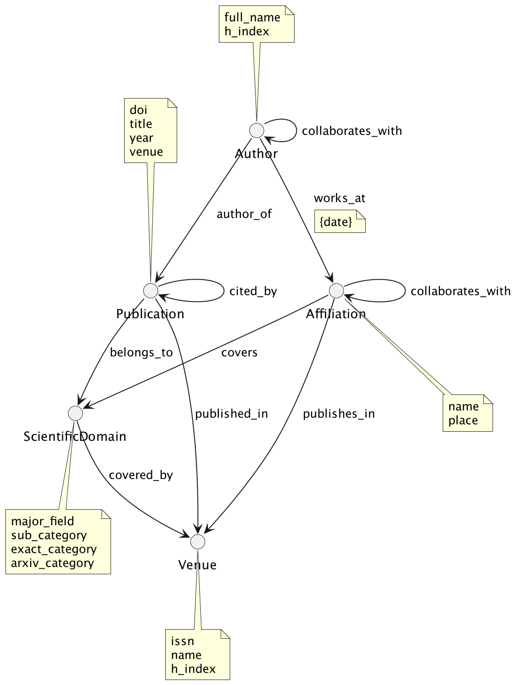

# Design
    "You can have data without information, 
    but you cannot have information without data." 
    — Daniel Keys Moran

Because data is the core of the data pipeline in the first chapter of the design document, the dataset given for this project is briefly introduced. Also, the main ideas and concepts, together with some examples of how the data will be enriched and transformed before loading it into the data warehouse (DWH) and a graph database (DB), are covered. In the second part of the document, the DWH schema and BI queries that this DWH will answer are discussed. And last but not least, in the third part, all the information about graph DB, including entities and relationships together with relevant queries, is considered.

## Data
ArXiv is the open-access archive for scholarly articles from a wide range of different scientific fields. The dataset given for the project contains metadata of the original arXiv data, i.e. metadata of papers in the arXiv. 
The metadata is given in JSON format and contains the following fields:
- id – publication arXiv ID
- submitter – the name of the person who submitted the paper/corresponding author
- authors – list of the names of the authors of the paper (in some cases, this field includes additional information about the affiliations of the authors)
- title – the title of the publication
- comments – additional information about the paper (such as the number of figures, tables and pages)
- journal-ref – information about the journal where the article was published
- doi – Digital Object Identifier (DOI) of the paper
- report-no – institution's locally assigned publication number
- categories – categories/tags in the arXiv system, i.e. field of the current study
- license – license information
- abstract – abstract of the publication
- versions – history of the versions (version number together with timestamp/date)
- update_date – timestamp of the last update in arXiv
- authors_parsed – previous authors field in the parsed form

In this project's scope, the fields of submitter, authors, title, journal-ref, doi, categories and versions will be used (all the others will be dropped). 
The undermentioned steps will be carried out to enrich the existing data with relevant and essential information. 
1.	Getting the additional information (its type, references/number of references, citations/number of citations, the total number of pages, and different attributes that are relevant for journal articles, such as an issue number) about the publication

Based on the existing data, three different tools for this task are considered for all the publications. (If possible, all of them will be used simultaneously.) 
    
   -	If the field of DOI is not NULL, then the Crossref REST API is used:
    
   
    
   *Figure 1 Example of retrieving the publication type based on DOI by using the Crossref REST API*
    
   
    
   *Figure 2 Example of retrieving the number of references based on DOI by using the Crossref REST API*
    
   -	If the field DOI is not NULL, also the OpenCitations API will be used:
    
   

   *Figure 3 Example of retrieving the number of citations based on DOI by using the OpenCitations API*
    
   -	If the DOI is missing, but the title and authors of the publications are given, then scholarly, which is a module that allows retrieving author and publication information from Google Scholar, is used:
    
   
 
   *Figure 4 Example of retrieving the number of citations based on title by using the scholarly module*

2.	Getting more information about the authors (for example, their real-life h-index or their full names)
    
   The scholarly module will be used:
    
   

   *Figure 5 Example of retrieving the author's real-life h-index by using a scholarly module*

3.	Resolving ambiguous or abbreviated conference or journal names
    
    The same tools mentioned above will be used.
4.	Normalising the field of study
    
    For that, each arXiv category will be mapped against the Scientific Disciplines classification table (https://confluence.egi.eu/display/EGIG/Scientific+Disciplines)
    For example, if the value in the arXiv category field is "cs.AI" after the mapping, besides this tag, there would be three new tags: major_field: "natural sciences", sub_category: "computer sciences" and exact_category: "artificial intelligence".

It is important to note that all the publications where essential data (like DOI together with authors and/or title) is missing will be dropped because this may lead to inconsistencies in the final data. (It means if it is  impossible to identify the publication unambiguously, all the data about it will be discarded.) 

While designing the data pipeline, data storage is another key component that needs to be kept in mind. This project uses the approach where the data will be stored in the up-to-date database to simulate the real-life setup where constant data updates are required because of its volatile nature (the number of citations of the publications changes, there could be a new version of the publication and so on). It means that instead of just having a single branch in the pipeline that ingests, transforms, and enriches the new data, there will be another separate branch to update the already existing data. In the following figure, the overall pipeline design is shown.

*Figure 6 Design of the data pipeline*

## DWH

After thoroughly investigating the data to understand what parts of it are usable for the project, it is possible to phrase the BI queries that would be the basis for developing a data warehouse. In the subsequent sections, the BI queries and the schema of DWH are discussed.
### Queries
- Getting authors (or ranking them)
    - with the most publications in a given year, scientific domain and/or publication venue
    - with the most citations in a given year, scientific domain and/or publication venue
    - with the highest h-index in a given time period
    - with the broadest horizon (authors who have written papers in the largest amount of different scientific domains)
- Getting institutions (or ranking them)
    - with the most publications in a given year, scientific domain and/or publication venue
    - that have the highest impact in scientific world (institutions that have papers which have been cited the most in a given year, scientific domain and/or publication venue)
- Getting publications (or ranking them)
    - with the  most citations in a given year, scientific domain and/or publication venue
- Getting journals (or ranking them)
    - with the highest h-index in a given year and/or scientific domain 
- What are the year's hottest topics (categories of scientific disciplines)?
- How does the number of publications on a given topic change during a given time frame (histograms of the number of publications on a given topic over a given period of time)?
- Who is the author whose h-index has increased the most during the given time?
- Which journal h-index has increased the most during the given time?

### Schema
Based on the formulated BI queries, the proper schema of a data warehouse for storing data about scientific publications would contain a fact table, "PUBLICATIONS", and five dimension tables: "AUTHORS", "AUTHORS' AFFILIATIONS", "PUBLICATION VENUES", "SCIENTIFIC DOMAINS" and "TIME" (see Figure 7).

*Figure 7 Schema of DWH*

The fact table "PUBLICATIONS" will store the primary keys of dimension tables (or dimension group keys in cases where bridge tables are used) as foreign keys together with additional information about the record (see Table 1 for more details). 

*Table 1 Attributes of the fact table together with explanations*
| Attribute | Explanation |
| --- | --------------------------------------------------- |
| authors_group_key	| the "AUTHORS" dimension group key; is required to get information about the authors of the publication |
| affiliations_group_key | the "AUTHORS' AFFILIATIONS" dimension group key; is required to get information about the affiliations of the authors of the publication |
| venue_ID | the primary key of the "PUBLICATION VENUES" dimension; is required to retrieve data about venues where the paper was published |
| domain_group_key | the "SCIENTIFIC DOMAINS" dimension group key; is required to get information about the field of study |
| time_ID | the primary key of the "TIME" dimension; is required to query when the publication was published (time information about the last version in the arXiv dataset at the moment when data was added to the DWH) |
| DOI | Digital Object Identifier (DOI) of the paper |
| title | the title of the publication |
| type | type ("journal article", "conference material", etc.) of the publication |
| number_of_authors | number of authors |
| submitter | the name of the person who submitted the paper/corresponding author |
| language | the language of the publication |
| volume | volume number; applicable when the paper is published in the journala | 
| issue | issue number; applicable when the paper is published in the journala |
| page_numbers | publication page numbers in the journal or the other published scientific papers collectiona |
| number_of_pages | total number of pages of the publication |
| number_of_reference | number of publications that present publication cites |
| no_versions_arXiv | number of versions of the current publication in the arXiv dataset; since the arXiv dataset is updated frequently, this field may change – a new version of the publication may be published |
| date_of_first_version | date when the first version (version v1 in arXiv) was created; is required for measuring the time interval between the first and current version of the publication |
| number_of_citations | number of publications that cite the present publication; this field may change over time |
| <td colspan=1>The following attributes are added for historical tracking. |
| is_current_snapshot | the flag to indicate if the row represents the current state of the fact; is updated when we add a new row for this pipeline occurrence |
| snapshot_valid_from | the date this row became effective |
| snapshot_valid_to | the date this row expired; is updated when a new row is added |

aIt is important to note that not all additional information fields are applicable in all cases. For example, workshop materials do not have an issue number. In these situations, the field will be filled as not-applicable.

As one can notice, the timestamped accumulating snapshots concept (https://www.kimballgroup.com/2012/05/design-tip-145-time-stamping-accumulating-snapshot-fact-tables/) is used for historical tracking of the data. This approach is suitable because the data will change infrequently. For example, the number of citations of one publication may increase very often during some period, but at the same time, there may be long time intervals during which this value remains the same.

In the dimension table "AUTHORS", all the relevant data about the publications' authors (name and h-index) will be stored. The difference between fields "h_index_real" and "h_index_calculated" is that the first h-index is retrieved by an API call and refers to the real-life h-index that the author has. The second h-index is calculated based on the data added to the DWH. The reason to keep both is that it is one way to immediately see if there is an error in the data pipeline – a calculated h-index could never be higher than a real-life one. Since one author can have several publications and one publication can have several authors (many-to-many relationship), the bridge table will be used to connect the author's dimension with specific facts. Additionally, an author's h-index (both of them) is a variable that changes over time. For BI queries (for example, getting the author whose h-index increased the most during the last year), tracking that change is essential. Therefore, the type 2 slowly changing dimensions concept is used – when the author's h-index changes, a new dimension record is generated. At the same time, the old record will be assigned a non-active effective date, and the new record will be assigned an active effective date. The bridge table will also contain effective and expiration timestamps to avoid incorrect linkages between authors and publications.

In the dimension table "AUTHORS' AFFILIATIONS", information about the institutions (name and location) of the authors of the publications will be gathered. Similarly to the authors' dimension, in this case, there could be a many-to-many relationship between the dimension and fact. In other words, there could be many publications from one institution, and authors of the same publication can have different affiliations. Therefore, the bridge table will be used to connect the dimension table records with the fact table records.

In this step, one may notice that there is no connection between the authors and the affiliations. (For example, in the authors' dimension table, there is no information about the author's affiliation.) The reasoning behind this decision is that BI queries (see the previous paragraph) do not require author-level information about affiliations. Based on the current schema, it is possible to fulfil all the queries requiring affiliations information.  

Dimension table "PUBLICATION VENUES" will store data about the venues of the publications. In this table, there could be many fields that do not apply to all the records. For example, if the type is "book", the field "h_index_calculated" is irrelevant. However, if the field h-index is applicable (for journals), similarly to the "AUTHORS" dimension table, tracking its changes is essential from the BI point of view. Therefore, this table will also use the type 2 slowly changing dimensions concept. 

In the dimension table "SCIENTIFIC DOMAINS", the categories (three levels) of scientific disciplines of publications will be gathered. Again, the bridge table will be used to overcome the shortcomings related to many-to-many relationships between publications and scientific domains (one publication can belong to many scientific domains, and many publications can have the same domain).

The "TIME" dimension will hold all the relevant (from the BI point of view) time information about the publications. Besides the timestamp of the publication, it also has separate fields for year, month and day. 

### Technologies

## Graph

To design the graph database, we used the labeled property graph model instead of RDF. It makes the graph look more concise and allows to specify properties next to nodes and edges. 

The database is designed to answer queries about relationships between authors (co-authorship), between authors and affiliations (employment), publications and scientific domains, and publications and venues. This is a sample list of queries that a user might be intrested in:

- Getting an author
    - who collaborates with a given author
    - who collaborates with a given author in a given year
    - who writes in a given scientific domain
    - who writes in a given venue
    - who writes for a given affiliation
- Getting a publication:
    - cited by a given publication
    - cited by a given author
    - published in a given venue
    - affiliated with a given affiliation
    - from a given scientific domain
- Getting an affiliation
    - that covers a given scientific domain
    - publishes in a given publication venue
    - employs a given author
- Getting a scientific domain
    - that is covered by a given affiliation
    - that is covered by a given publication venue
    - that is covered by a given author
- Getting a publication venue
    - that covers a given scientific domain
    - that publishes for a given affiliation
    - that publishes for a given author

Besides that, we also want to answer questions like these:

- What's a community of authors
    - that covers a given scientific domain?
    - that publishes in a given publication venue?
    - that publishes for a given affiliation?
- What author has the most self-citations (citations to other others from the same affiliation)?
- What author has the most collaborations?
- Is there a connection between collaborators and where they publish their papers?

### Schema

The property graph diagram below shows entities of the database and their relationships. The entities are represented as nodes, the relationships are represented as directed edges, and properties are displayed as notes on a yellow background. All entities contain properties relevant to queries above. One of the edges, `(:Author)-[:works_at {date}]->(:Affiliation)`, also contains a property to indicate that the relationship is temporal and that might be important for some queries. Nodes like `(:Author)`, `(:Affiliation)`, and `(:Publication)` can have self loops to indicate co-authorship, employment, and self-citations, respectively.

#### Entities with properties

| Entity | Properties |
| --- | --- |
| Author | full_name, h_index |
| Affiliation | name, place |
| Publication | doi, title, year |
| ScientificDomain | major_field, sub_category, exact_category, arxiv_category |
| Venue | issn, name, h_index |

#### Relationships

- AUTHOR_OF: `(:Author)-[:AUTHOR_OF]->(:Publication)`
- COLLABORATES_WITH: `(:Author)-[:COLLABORATES_WITH]->(:Author)`
- WORKS_AT: `(:Author)-[:WORKS_AT {date}]->(:Affiliation)`

- PUBLISHED_IN: `(:Publication)-[:PUBLISHED_IN]->(:Venue)`
- BELONGS_TO: `(:Publication)-[:COVERS]->(:ScientificDomain)`
- CITED_BY: `(:Publication)-[:CITED_BY]->(:Publication)]`

- COVERS: `(:Affiliation)-[:COVERS]->(:ScientificDomain)`
- PUBLISHES_IN: `(:Affiliation)-[:PUBLISHES_IN]->(:Venue)`
- COLLABORATES_WITH: `(:Affiliation)-[:COLLABORATES_WITH]->`(:Affiliation)

- COVERED_BY: `(:ScientificDomain)-[:COVERED_BY]->(:Venue)`

### Technologies

To implement the graph model, we plan to use Neo4j with Cypher as the query language. Neo4j is an ACID-compliant transactional database widely used for graph data with native graph storage and processing. It supports the property graph model and is widely used in the industry while being developed since 2007 by Neo4j, Inc. 

## Data Transformation

...

## Pipeline

...
