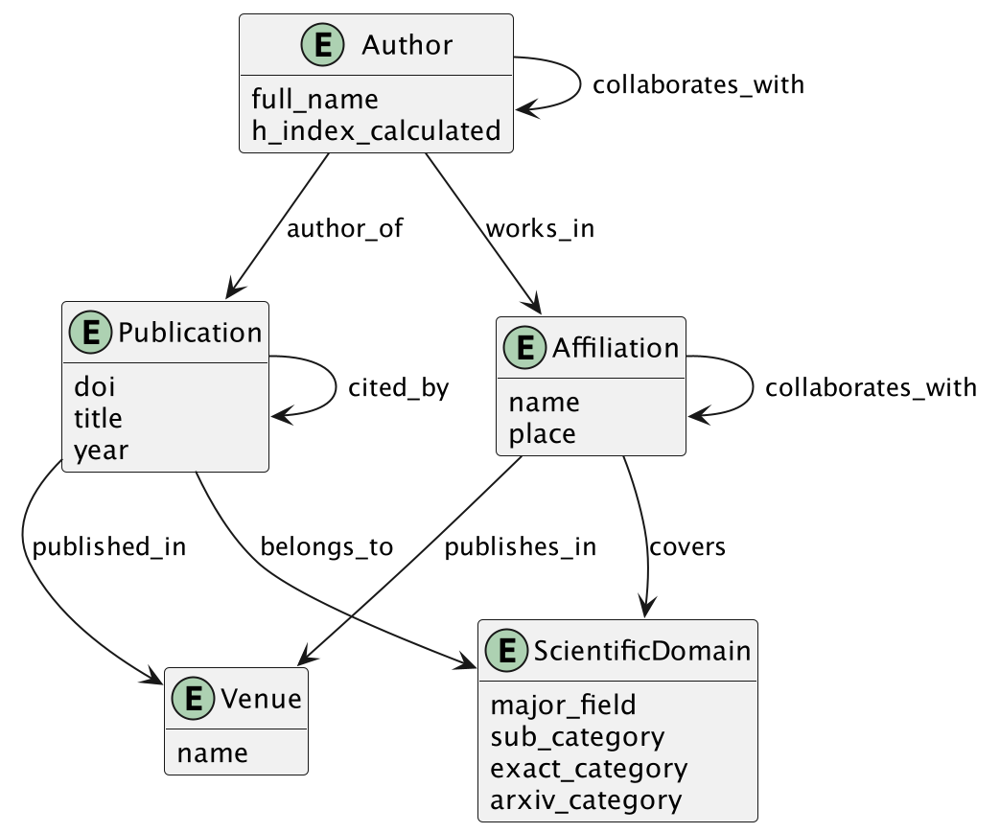

<div dir="rtl">DATA ENGINEERING (LTAT.02.007)</div>
<div dir="rtl">GROUP 12</div>
<div dir="rtl">Timofei Ganjušev</div>
<div dir="rtl">Siim Karel Koger</div>
<div dir="rtl">Ida Rahu</div>
<div dir="rtl">Ihar Suvorau</div>

# FINAL REPORT

<div dir="rtl">Data is like garbage. You'd better know what</div>
<div dir="rtl">you are going to do with it before you collect it.</div>
<div dir="rtl">— Mark Twain</div>


In this project, a data pipeline to analyse data about scientific publications was built. In figure 1, the overall pipeline design is shown. As one can see, the pipeline can be divided into three main parts/stages and the first part additionally into two subparts (1A so-called transformation pipeline and 1B so-called updating pipeline). In the first part, 1A, the new raw data in JSON format is ingested into the pipeline, where it is transformed and enriched and then loaded into the up-to-date database. In subpart 1B, the data in the up-to-date database is updated periodically. Also, in the first part of the pipeline, the data is prepared in the correct form (the CSV files are written), so it can be uploaded into the data warehouse (DWH) (part 2) and the graph database (DB) (part 3). In the final report, all these stages are thoroughly covered, including the DWH and graph DB designs, together with relevant queries that DWH and graph DB will answer. And last but not least, the guidelines for running the built data pipeline are given.


**Figure 1** Design of the overall data pipeline

## Part 1

### Dataset and pre-pipeline processing

ArXiv is the open-access archive for scholarly articles from a wide range of different scientific fields. The dataset given for the project contains metadata of the original arXiv data, _i.e._ metadata of papers in the arXiv. The metadata is given in JSON format and contains the following fields:

- `id` – publication arXiv ID
- `submitter` – the name of the person who submitted the paper/corresponding author
- `authors` – list of the names of the authors of the paper (in some cases, this field includes additional information about the affiliations of the authors)
- `title` – the title of the publication
- `comments` – additional information about the paper (such as the number of figures, tables and pages)
- `journal-ref` – information about the journal where the article was published
- `doi` – Digital Object Identifier (DOI) of the paper
- `report-no` – institution's locally assigned publication number
- `categories` – categories/tags in the arXiv system, i.e. field of the current study
- `license` – license information
- `abstract` – abstract of the publication
- `versions` – history of the versions (version number together with timestamp/date)
- `update_date` – timestamp of the last update in arXiv
- `authors_parsed` – previous authors field in the parsed form

In this project's scope, the fields of `submitter`, `title`, `journal-ref`, `doi`, `categories`, `versions` and `authors_parsed` were used (all the others were dropped). 

The original dataset contains information about more than 2 million publications. The original dataset was split into smaller parts (44 parts in total, each containing information about 50K publications) to simulate a real-life situation where new data is coming in continuously. (The dataset splitting was conducted using the [split_dataset.py](https://github.com/idarahu/DE-project/blob/main/ETL/split_dataset.py) script.) Also, before ingesting the data into the pipeline, the publications whose data will be enriched were selected. This preselection was made because the enrichment process via API calls is very time-consuming; therefore, enriching all the publications' data is out of this project's scope. (While running the transformation pipeline, this difference is vividly illustrated when one compares the average run times between the first (ingested raw data contains the publication whose data is enriched via API calls) and all the other runs (data is not enriched via API calls).) For picking out the publications for enrichment, the publications with DOI (needed for API calls) were first filtered out. Afterwards, they were grouped by categories (major field + sub-category, see table 1), and 20 publications were selected from each category. (The details about how publications have been divided into these categories are given in the next chapter.) Finally, their DOIs were written into the [DOIs_for_enrichment.csv](https://github.com/idarahu/DE-project/blob/main/ETL/airflow/data/setups/DOIs_for_enrichment.csv) file. This file is used in the transformation pipeline, as explained in the next chapter.

**Table 1** Categories (major field together with one sub-category forms one category) that are used for selecting the publications that are going to be enriched


### Transformation pipeline (1A)

As mentioned before, the first part of the overall pipeline can be divided into two subparts: transformation pipeline (1A) and updating pipeline (1B). This chapter covers the concepts of the transformation pipeline. The details about the updating pipeline are given in the next chapter.

In the transformation pipeline, the raw data in JSON format (as explained in the previous chapter: 50K publications at once) is ingested into the overall pipeline; then, this data is cleaned and enriched if needed and loaded into the up-to-date database. Because this project uses the approach where the data will be stored in the up-to-date database to simulate the real-life setup where constant data updates are required because of its volatile nature (the number of citations of the publications changes and so on) before discussing all the details about transformation pipeline, main concepts of this database are given. The schema of this DB is shown in figure 2.


**Figure 2** Schema of an up-to-date database

As one can see, the up-to-date DB consists of 9 relations. The table "AUTHORS" contains all the relevant information, such as last name, first name, the abbreviation of the first name, extra titles (such as Jr., I, II etc.), positions, and real-life h-index, about the publications' authors in the DB. In the table "AFFILIATIONS", the institution names and places where the authors of publications work are gathered. In the table "PUBLICATIONS", the data about publications (such as DOI, title, publishing date of first and last version, name of the submitter, type and language of publication, volume, issue and page numbers, number of references and citations) are recorded. The relation "ARXIV_CATEGORIES" contains information about publications' arXiv categories. In the relation "VENUES", all the data about venues (full name, abbreviation, print and electronic ISSN) where publications were published are collected. All other relations are created to deal with the entities' m:n relationships.

The Airflow DAG [`transform_create_tables`](https://github.com/idarahu/DE-project/blob/main/ETL/airflow/dags/transform_create_tables.py) (see figure 3) was written to create this Postgres database. This DAG should be run only once at the very beginning of the overall pipeline. During the run, all the database tables are generated. Besides, all the other SQL statements needed in the first part of the overall pipeline are also generated. These SQL statements include the ones used for populating the tables with new data or updating the existing data (considering all the constraints that are present in the DB), together with the statements used for generating the views (authors' view and venues' view) that are needed for getting the data in the correct form to load into the DWH and graph DB. (The mentioned authors' view contains authors' IDs, last, first, and full names, first name abbreviations, positions, real-life h-indices, and the h-indices calculated based on the data present in the DB. In the venues' view, besides the data that this in the "VENUES" table (venue ID, full name, abbreviation, print and electronic ISSN), also the calculated h-index for each venue is given.) 


**Figure 3** Airflow DAG `transform_create_tables`

The transformation pipeline itself is implemented as an Airflow DAG [`transform_articles`](https://github.com/idarahu/DE-project/blob/main/ETL/airflow/dags/transform_articles.py). The graph representation of this DAG is shown in the following image.


**Figure 4** Airflow DAG `transform_articles`

The prerequisite for running this DAG is that the "data" folder should contain seven subfolders: "inputs", "setups", "metadata", "lookup_tables", "data2db", "sql", and "final_data" (see table 2). 

**Table 2** Data folders required for running the first part of the pipeline

|Subfolder|Explanation|
|:-:|---|
|[inputs](https://github.com/idarahu/DE-project/tree/main/ETL/airflow/data/inputs)|The raw JSON datasets generated during pre-pipeline processing by splitting the original arXiv dataset are stored in this folder.|
|[setups](https://github.com/idarahu/DE-project/tree/main/ETL/airflow/data/setups)|It contains three files: `DOIs_for_enrichment.csv`, `publication_ID.txt`, and `split_no.txt`. `DOIs_for_enrichment.csv` contains DOIs of the articles, which data will be enriched during the transformation pipeline (see chapter "Dataset and pre-pipeline processing"). The file `publication_ID.txt` is used for storing the last publication ID to ensure that all the publication IDs are unique. Before the first run of the pipeline, the ID in this file should be 0. The file `split_no.txt` is used for a similar purpose – storing the number of the previously used dataset to ensure that all datasets are ingested only once. Before the first run of the pipeline, the split number should be 0.|
|[metadata](https://github.com/idarahu/DE-project/tree/main/ETL/airflow/data/metadata)|Before the first run of the `transform_articles` DAG, this folder should be empty. After, it should always contain one file, `metadata_df.tsv`. This file is generated in task `convert_metadata_for_ingestion`, during which the relevant fields (see the previous chapter) for each publication are filtered out from the raw JSON file. (The received data, ready for further usage in the transformation pipeline, is stored in this TSV file.)|
|[lookup_tables](https://github.com/idarahu/DE-project/tree/main/ETL/airflow/data/lookup_tables)|It contains four tables: `cities_lookup.tsv`, `lookup_table_domains.csv`, `universities_lookup.tsv`, and `venues_lookup.tsv`. All these tables (except `lookup_table_domains.csv`) are used for enriching and transforming the raw data. For enriching and transforming the: 
||-	affiliations' data the `cities_lookup.tsv` and `universities_lookup.tsv` are used. In the `cities_lookup.tsv`, the names of 42905 world's largest cities (including the Unicode and ASCII strings) together with names of countries are given. This data was retrieved from [SimpleMaps.com](https://simplemaps.com/data/world-cities). In the `universities_lookup.tsv`,  the data (names, countries, cities/locations and abbreviations of locations) of about 1152 world universities are stored. This data was retrieved by merging and preprocessing the [World University Rankings](https://www.kaggle.com/datasets/mylesoneill/world-university-rankings) dataset and [University Rankings 2017](https://data.world/education/university-rankings-2017) dataset.|
||-	venues' data the `venues_lookup.tsv` is used. This dataset contains information such as the name and abbreviation (with and without dots) of 87224 venues. This dataset was retrieved from the [Web Of Science](https://images.webofknowledge.com/images/help/WOS/A_abrvjt.html). To make the enrichment process easier and faster, the dataset was preprocessed, and therefore the lookup table also contains fields `abbrev_check` and `full_check`. The lowercase abbreviations and full names of venues without spaces are stored in these fields.|
||The file `lookup_table_domains.csv` is used in task `copy_publication2arxiv`. Comprehensive information about scientific domains should be provided to populate the DWH and graph DB with data. However, in up-to-date DB, only arXiv categories are stored (see figure 2). Therefore, the data copied from the DB needs to be enriched before it can be used for DWH and graph DB. The `lookup_table_domains.csv` is employed for that purpose. (More details are provided below.)|
|[data2db](https://github.com/idarahu/DE-project/tree/main/ETL/airflow/data/data2db)|The data that will be loaded into the up-to-date database are stored in this folder. Before the first run, it should contain two files: `arxiv_categories.csv` and `venues_df.tsv`. By the way, the latter should contain only the header row (`venue_ID\tfull_name\tabbreviation\tprint_issn\telectronic_issn`) before the first run of the pipeline. In the `arxiv_categories.csv`, the IDs and arXiv category names of 156 categories are stored.|
|[sql](https://github.com/idarahu/DE-project/tree/main/ETL/airflow/data/sql)|This folder is used for storing all the SQL statements. Before the first run, the folder should be empty, but after running the `transform_create_tables` DAG, the .sql files are generated and saved in this folder.|
|[final_data](https://github.com/idarahu/DE-project/tree/main/ETL/airflow/data/final_data)|This folder should contain the data in the correct form, ready to be loaded into the DWH and graph DB. Before the first run of the pipeline, this folder should be empty.|

The transformation pipeline starts with the task `convert_metadata_for_ingestion` (see figure 5). During this task, the new dataset (a 50K subset of the original dataset) is selected and ingested into the pipeline.


**Figure 5** Schema of the task `convert_metadata_for_ingestion`

Firstly, the fields `submitter`, `title`, `journal-ref`, `doi`, `categories`, `versions` and `authors_parsed` are filtered out from the raw JSON file. Then the values of these fields are preprocessed if necessary. For example, the field `versions` is used to get the date of the first and last version and the total number of versions in arXiv required in the up-to-date DB in the table "PUBLICATIONS". Besides, a new unique ID (`publication_ID`) is generated for each publication. At the end of the `convert_metadata_for_ingestion`, all the relevant information retrieved from the original dataset is saved as a file `metadata_df.tsv` (in the folder `metadata`). This file contains the fields `publication_ID`, `submitter`, `authors`, `title`, `journal_ref`, `doi`, `categories`, `no_versions_arxiv`, `date_of_first_version`, and `date`. Some of the values of these fields (`submitter`, `doi`, `no_versions_arxiv`, `date_of_first_version`, and `date`) are used without further processing. (These values are stored in their present form in up-to-date DB in the table "PUBLICATIONS"). The file `metadata_df.tsv` is used for passing the data to the following tasks.

The next three tasks that run in parallel, `transform_venues_and_publications_data` (figure 6), `transform_arxiv_data` (figure 7)  and `transform_authors_and_affiliations_data` (figure 8), can be considered the most critical tasks in the transformation pipeline. The main cleaning, transformation, and enrichment processes are performed during these tasks. 
 
**Figure 6** Schema of the task `transform_venues_and_publications_data`

During the task `transform_venues_and_publications_data`, the following steps are carried out.
1.	The title of the publication is cleaned (the symbols of the newline are removed).
2.	To get the information about venues (name and abbreviation), the field `journal_ref` (present in `metadata_df.tsv`) is used. The data in this field is cleaned and then checked if it matches with any venue in the lookup table `venues_lookup.tsv` (by using the function `find_venue(venue_data_raw)`). (At the end, these values are stored in up-to-date DB in the table "VENUES").
3.	The field `doi` is used for getting additional information (its type, number of references, citations/number of citations, page numbers, and different attributes relevant to journal articles, such as an issue number) about the publication. This method for enrichment is considered only when the DOI of publication is in the file `DOIs_for_enrichment.csv`, as mentioned before (see chapter "Dataset and pre-pipeline processing"). Two APIs are used to retrieve a piece of extra information: [Crossref REST API](https://www.crossref.org/documentation/retrieve-metadata/rest-api/) and [OpenCitations API](https://doi.org/10.6084/M9.FIGSHARE.6683855) (see the following examples). 
```
# Example of retrieving the publication type based on DOI by using the Crossref REST API

crossref_results = crossref_commons.retrieval.get_publication_as_json('10.1103/PhysRevA.75.043613')
print(crossref_results['type'])

# Output:
journal-article

# Example of retrieving the number of references based on DOI by using the Crossref REST API

crossref_results = crossref_commons.retrieval.get_publication_as_json('10.1103/PhysReVA.75.043613')
print(crossref_results['reference-count'])

# Output:
23

# Example of retrieving the number of citations based on DOI by using the OpenCitations API

client = opencitingpy.client.Client()
open_citation_result = client.get_citation_count('10.1103/PhysReVA.75.043613')
print(open_citation_result)

# Output:
13
```

4.	The unique ID is generated for each venue (field `venue_ID`). If the publication does not have information about the venue available, the 0 is used as a `venue_ID`.
5.	The TSV files (`venues_df.tsv` and `publications_df.tsv`) needed for populating the tables "VENUES" and "PUBLICATIONS" in up-to-date DB are written. Additionally, the TSV file (`citing_pub.tsv`), where the publication ID and the DOIs of the publications that cite this publication, are recorded. (This file is required for the graph database.)

During the task `transform_arxiv_data`, the field categories in `metadata_df.tsv` is used to map each publication with arXiv categories (stored in `arxiv_categories.csv`). The received information is saved as file `publication2arxiv_df.tsv`. In the end, arXiv categories are stored in up-to-date DB in the table "ARXIV_CATEGORIES" and mapping data in the table "PUBLICATION2ARXIV".


**Figure 7** Schema of the task `transform_arxiv_data`

And last but not least, the following list explains the steps carried out during the task `transform_authors_and_affiliations_data`.
1.	The relevant fields, such as `publication_ID` and `authors_parsed`, are filtered out from `metadata_df.tsv`.
2.	The field `authors_parsed` contains information about the authors' names. Therefore, it is processed (by using functions `check_first_name_raw(first_name_raw_to_check)` and `parse_first_name(first_name_raw_to_parse)`) to get the last and first names together with the abbreviation of each author's first name. Sometimes, this field also contains some extra suffixes of the name, such as Jr or II *etc*., which are also stored. (To check the extra suffixes, the function `extra_or_affiliation(value1, value2)` is employed.) (At the end, these values are stored in up-to-date DB in the table "AUTHORS"). 
3.	The field `authors_parsed` can also include data about authors' affiliations. Thus, the function `find_insitution_information(institution_name_raw, universites_lookup, cities_lookup)` is called to find whether this raw data field matches any institution or location stored in the `universities_lookup.tsv` or `cities_lookup.tsv`. It is important to note that data about location/place after the transformation pipeline is always at the country level. (At the end, these values, institution name and place, are stored in up-to-date DB in the table "AFFILIATIONS").
4.	*To enrich the authors' information (to receive their real-life h-indices or position), the [scholarly](https://github.com/scholarly-python-package/scholarly) (and function `do_scholarly_call(author)`) is used. This module allows retrieving the authors' and publications' information from Google Scholar.* 
```
# Example of retrieving the author's real-life h-index by using a scholarly module

search_query = scholarly.search_author('S. Wichmann')
first_author_result = next(search_query)
author = scholarly.fill(first_author_result)
print(author['hindex'])

# Output:
39
```
*However, since scholarly has a limited number of times to retrieve the data, this part of the pipeline's code is now commented in to prevent it from running. Therefore, the relevant lines in the function 'get_authors_and_affiliations_data()' should be commented out before running the pipeline if one wants to use scholarly.
5.	The TSV files (`authors_df.tsv` and `affiliations_df.tsv`) needed for populating the tables "AUTHORS" and "AFFILIATIONS" in up-to-date DB are written.* 

 
**Figure 8** Schema of the task `transform_authors_and_affiliations_data`
(P.S. During these three tasks, all the missing strings are replaced with `None` and integers with `-1.`)
After these tasks, the data is loaded into the up-to-date DB. In the cases where it is necessary to check that only new data is loaded to ensure that there would be no duplicates in the DB,  the additional temporary tables (such as "AFFILIATION2PUBLICATION_TEMP",  "AFFILIATIOS_TEMP", "AUTHORS_TEMP" and "PUBLICATIONS_TEMP") are used. (These tables are always emptied before a new batch of data.) To illustrate how the temporary tables are used, the following example is given. Initially, data about authors is bulk inserted into the "AUTHORS_TEMP" table. Then the data of each author is compared with the data of each author in the "AUTHORS" table. If the author's information is not already present in the DB, a new author is inserted into the "AUTHORS" table. Otherwise, the data about the author is discarded. The same comparison is made between all the corresponding temporary and permanent tables.

In the last step of the transformation pipeline, the data in the database is copied and stored in CSV files. These files are used for loading the data into DWH and graph DB. Appropriate views are generated beforehand to get all the required information (like calculated h-indices of the venues and authors). Also, the field of study is normalised. For that, each arXiv category is mapped against the Scientific Disciplines classification table4. (This table is stored in suitable form in `lookup_table_comains.csv`.) For example, if the value in the arXiv category field is `cs.AI` after the mapping, besides this tag, there are three new tags: `major_field: natural sciences`, `sub_category: computer sciences` and `exact_category: artificial intelligence`.


### Updating pipeline (1B)

To fulfil the prerequisites of using the up-to-date DB approach, the data about publications in the database should be updated periodically (for example, monthly). For that reason, the Airflow DAG [`transform_periodic_update`](https://github.com/idarahu/DE-project/blob/main/ETL/airflow/dags/transform_periodic_update.py) was built (see figure 9). 
 
**Figure 9** Airflow DAG `transform_periodic_update`

During the run of this DAG, the publications with DOIs, that are stored in DB are updated by using their DOIs and OpenCitations API. In this project, only the number of citations is considered as changing field. If the API call returns a new value for this variable, the data about publication is updated. Since venues' and authors' h-indices depend on the number of citations, the relevant views are refreshed after updates.
Similarly to the transformation pipeline, updating the pipeline ends with copying the data. However, at this time, only publications', authors' and venues' data is copied and saved as CSV files ready for the following pipeline parts (other tables in DB do not change).
(Since API calls are very time-consuming, additional DAG [`transform_periodic_update_presentation`](https://github.com/idarahu/DE-project/blob/main/ETL/airflow/dags/transform_periodic_update_presentation.py) was generated. This DAG is a copy-paste version of the DAG update_articles_in_DB. The only difference is that instead of pulling all publications' data from DB, it limits the number of publications to 200. This DAG has only the illustrative purpose of how the updates should work – updating all the publications at once is out of this project's scope.))


## Part 2

After thoroughly investigating the data to understand what parts of it are usable for the project, it is possible to phrase the BI queries that would be the basis for developing a data warehouse. In the subsequent sections, the BI queries, the schema of DWH and the technologies that will be used are discussed.

### QUERIES

#### [Ranking authors](https://github.com/idarahu/DE-project/tree/main/queries_dwh/authors)
- With the most publications in a given year, scientific domain and/or publication venue
- With the most citations in a given year, scientific domain and/or publication venue
- With the highest h-index in a given time period
- With the broadest horizon (authors who have written papers in the largest amount of different scientific domains)
#### [Ranking institutions](https://github.com/idarahu/DE-project/tree/main/queries_dwh/institutions)
- With the most publications in a given year, scientific domain and/or publication venue
- That have the highest impact in the scientific world (institutions that have papers which have been cited the most in a given year, scientific domain and/or publication venue)
#### [Ranking publications](https://github.com/idarahu/DE-project/tree/main/queries_dwh/publications)
- With the most citations in a given year, scientific domain and/or publication venue
#### [Ranking journals](https://github.com/idarahu/DE-project/tree/main/queries_dwh/venues)
- With the highest h-index in a given year and/or scientific domain 
#### [Hot topics](https://github.com/idarahu/DE-project/tree/main/queries_dwh/hottest_topics)
- What are the year's hottest topics (categories of scientific disciplines)? 
#### [Publications over time](https://github.com/idarahu/DE-project/tree/main/queries_dwh/change_in_num_of_publications) 
- How does the number of publications on a given topic change during a given time frame?
#### [Publish speed](https://github.com/idarahu/DE-project/tree/main/queries_dwh/publishing_speed)
- Which papers have the most prolonged period between the first and last version? 
- Are there any journals where publishing takes much more time compared to others?

### Queries examples
Basic:
"Authors with most publications in given year (2022)."
SQL:
https://github.com/idarahu/DE-project/blob/main/queries_dwh/authors/authors_with_most_pubs_in_year.sql

INSERT PIC 1


More interesting
"Hottest topics (major field) in year 2022"
SQL:
https://github.com/idarahu/DE-project/blob/main/queries_dwh/hottest_topics/hottest_topics_major_field_by_time.sql

INSERT PIC 2

### SCHEMA


Based on the formulated BI queries, 
the proper schema of a data warehouse for storing data about 
scientific publications would contain a fact table, "PUBLICATIONS", 
and five dimension tables: "AUTHORS", "INSTITUTION", "PUBLICATION VENUES", "SCIENTIFIC DOMAINS" and "TIME" (see Figure 2).


**Figure 2** Schema of DWH

The fact table "PUBLICATIONS" will store the primary keys of dimension tables (or dimension group keys in cases where bridge tables are used) as foreign keys together with additional information about the record (see Table 1 for more details).

**Table 1** Attributes of the fact table together with explanations

| **Attribute**                                                 | **Explanation**                                                                                                                                                                                              |
|---------------------------------------------------------------|--------------------------------------------------------------------------------------------------------------------------------------------------------------------------------------------------------------|
| id                                                            | generated primary key for fact table                                                                                                                                                                         |
| venue\_id                                                     | the primary key of the "PUBLICATION VENUES" dimension; is required to retrieve data about venues where the paper was published                                                                               |
| time\_id                                                      | the primary key of the "TIME" dimension; is required to query when the publication was published (time information about the last version in the arXiv dataset at the moment when data was added to the DWH) |
| doi                                                           | Digital Object Identifier (DOI) of the paper                                                                                                                                                                 |
| title                                                         | the title of the publication                                                                                                                                                                                 |
| number\_of\_authors                                           | number of authors                                                                                                                                                                                            |
| submitter                                                     | the name of the person who submitted the paper/corresponding author                                                                                                                                          |
| lang                                                          | the language of the publication                                                                                                                                                                              |
| volume                                                        | volume number; applicable when the paper is published in the journala                                                                                                                                        |
| issue                                                         | issue number; applicable when the paper is published in the journala                                                                                                                                         |
| page\_numbers                                                 | publication page numbers in the journal or the other published scientific papers collectiona                                                                                                                 |
| number\_of\_references                                        | number of publications that present publication cites                                                                                                                                                        |
| no\_ver\_arxiv                                                | number of versions of the current publication in the arXiv dataset; since the arXiv dataset is updated frequently, this field may change – a new version of the publication may be published                 |
| date\_of\_first\_version                                      | date when the first version (version v1 in arXiv) was created; is required for measuring the time interval between the first and current version of the publication                                          |
| number\_of\_citations                                         | number of publications that cite the present publication; this field may change over time                                                                                                                    |
| _The following attributes are added for historical tracking._ |
| snapshot\_valid\_from                                         | the date this row became effective                                                                                                                                                                           |
| snapshot\_valid\_to                                           | the date this row expired; is updated when a new row is added                                                                                                                                                |

It is important to note that not all additional information fields are applicable in all cases.
In these situations, the field will be filled as not-applicable.

As one can notice, the timestamped accumulating snapshots concept is used for 
historical tracking of the data. 
This approach is suitable because the data will change infrequently. 
For example, the number of citations of one publication may increase very often during some period, 
but at the same time, there may be long time intervals during which this value remains the same.

In the dimension table "AUTHORS", all the relevant data about the publications' 
authors (name and h-index) will be stored. 
The difference between fields "h\_index\_real" and "h\_index\_calculated" 
is that the first h-index is retrieved by an API call and refers to the real-life h-index 
that the author has. The second h-index is calculated based on the data added to the DWH. 
The reason to keep both is that it is one way to immediately see if there is an error 
in the data pipeline – a calculated h-index could never be higher than a real-life one.

Since one author can have several publications and one publication can have several authors 
(many-to-many relationship), the bridge table will be used to connect the author's dimension 
with specific facts. Additionally, an author's h-index (both of them) is a 
variable that changes over time. For BI queries (for example, getting the author whose 
h-index increased the most during the last year), tracking that change is essential. 
Therefore, the type 2 slowly changing dimensions concept is used – when the author's 
h-index changes, a new dimension record is generated. 
At the same time, the old record will be assigned a non-active effective date (valid_to =/= NULL), 
and the new record will be assigned an active effective date (valid_to == NULL).

In the dimension table "INSTITUTION", information about the institutions (name and location) of the 
authors of the publications will be gathered. Similarly to the authors' dimension, in this case, 
there could be a many-to-many relationship between the dimension and fact. 
In other words, there could be many publications from one institution, and authors of the 
same publication can have different affiliations. 
Therefore, the bridge table will be used to connect the dimension table records with the fact 
table records.

In this step, one may notice that there is no connection between the authors and the institutions. 
(For example, in the authors' dimension table, there is no information about the author's institution.) 
The reasoning behind this decision is that BI queries (see the previous section) 
do not require author-level information about affiliations. 
Based on the current schema, it is possible to fulfil all the queries requiring 
institutions information.

Dimension table "PUBLICATION VENUES" will store data about the venues of the publications. 
In this table, there could be many fields that do not apply to all the records. 
For example, if the type is "book", the field "h\_index\_calculated" is irrelevant. 
However, if the field h-index is applicable (for journals), similarly to the "AUTHORS" 
dimension table, tracking its changes is essential from the BI point of view. 
Therefore, this table will also use the type 2 slowly changing dimensions concept.

In the dimension table "SCIENTIFIC DOMAINS", the categories
of scientific disciplines of publications will be gathered. 
Again, the bridge table will be used to overcome the shortcomings related to 
many-to-many relationships between publications and scientific domains 
(one publication can belong to many scientific domains, and many publications can have the same domain).

The "TIME" dimension will hold all the relevant (from the BI point of view) time information 
about the publications. Besides the timestamp of the publication, 
it also has separate fields for year, month and day.

### PIPELINE


In order to support slowly changing dimensions (SCD) the updating data warehouse database the pipeline was created.
The pipeline request the data which was generated by articles2db dag mentioned in injection/transformation part.
It contains saves data mentioned in star schema with duplicate safe technique:
- every insertion query has validation for duplicate check
- returning inserted or saved for every entity
- calculated the h index based in stored data after data loading is complete

### TECHNOLOGIES

**PostreSQL with Citus extension**

The Postgres with Citus extension is chosen as a data warehouse database.
However, the Official container for postgres extension does not support ARM64 platform and the overall performance is decreased by emulator.
Because of that fact, the official Postgres without citus extension was used with indexes.

**Swifter**

[Swifter](https://github.com/jmcarpenter2/swifter) library was used in pair with Pandas library for loading and transforming the datasets.
It adds multicore usage for different pandas dataframe core transformation functions.

**PostgreSQL**

PostgreSQL is an open-source object-relational database solution with a solid background, up-to-date documentation, popularity across top-tech companies and a strong community.

The database supports various data types, including JSON/JSONB; all the innovations come from Postgres extensions. It has different optimisation tools for analytical queries, such as indexes12 and table partitioning13.

**Citus**

However, the PostgresSQL build-in features deliver a powerful tool, but for better analytical query processing and potential database growth, the Citus14 extension would also be used in the solution. Citus is a Postgres extension that supports sharding, paralleling SQL across multiple nodes supported and owned by Microsoft15. It delivers insanely fast performance. Even with real-time data ingest and billions of rows of data. The idea of Citus extension was initially designed as an OLAP solution based on PostgreSQL. Moreover, the focus of development is changes, and today Citus does either: OLTP and HTAP16.

**ClickHouse benchmark (Citus vs MariaDB with ColumnStore)**

According to the ClickHouse benchmark, the main SQL competitor is MariaDB with ColumnStore extension. However, it does not support all SQL operations. The Citus outperforms the MariaDB in DB storage size and loading the data to the database but is less performant in cold and hot data retrieving. In the benchmark, the indexes optimisation was not used for Postgres solution, but with them, it would outperform the main competitor in many scenarios.

**Production implementation facts**

Postgres with Citus extension is used on Azure for a petabyte-scale analytical solution17.

## Part 3. Graph Database

### Design

The labelled property graph model is used instead of RDF to design the graph database. It makes the graph look more concise and allows to specify properties next to nodes and edges. The initial design of the graph database, described in the "Group12 Design Document", has not changed significantly. In the following list, all the changes are given:

* The relationship between the author and affiliation has been renamed from WORKS_AT to WORKS_IN
* WORKS_IN `data` attribute has been dropped to simplify the graph and reduce the team's workload. However, that information still can be retrieved by querying the author's publications that have the `year` attribute.
* COVERED_BY relationship between ScientificDomain and Venue has been dropped. Venues for scientific domains can be retrieved by querying publications or affiliations that have direct relationships with venues.

The property graph diagram below (figure 11) shows the database entities and their relationships. The entities are represented as nodes; the relationships are represented as directed edges, and node properties are specified inside nodes. In Table 4, the same entities together with properties and in Table 5, the same relationships are also given.


**Figure 1**. Schema of the graph database
**Table 4** Entities and their properties that are used in the graph database
| Entity           | Properties                                                |
|------------------|-----------------------------------------------------------|
| Author           | full_name, h_index_calculated                             |
| Affiliation      | name, place                                               |
| Publication      | doi, title, year                                          |
| ScientificDomain | major_field, sub_category, exact_category, arxiv_category |
| Venue            | full_name                                                 |

**Table 5** Relationships between the entities in the graph DB
| Relationship|Representation |
|:-:|---|
|AUTHOR_OF|`(:Author)-[:AUTHOR_OF]->(:Publication)`|
|COLLABORATES_WITH|`(:Author)-[:COLLABORATES_WITH]->(:Author)`|
|WORKS_IN|`(:Author)-[:WORKS_IN}]->(:Affiliation)`|
|PUBLISHED_IN|`(:Publication)-[:PUBLISHED_IN]->(:Venue)`|
|BELONGS_TO|`(:Publication)-[:COVERS]->(:ScientificDomain)`|
|CITED_BY|`(:Publication)-[:CITED_BY]->(:Publication)`|
|COVERS|`(:Affiliation)-[:COVERS]->(:ScientificDomain)`|
|PUBLISHES_IN|`(:Affiliation)-[:PUBLISHES_IN]->(:Venue)`|
|COLLABORATES_WITH|`(:Affiliation)-[:COLLABORATES_WITH]->(:Affiliation)`|

### Implementation

After the initial transformation and data enrichment finishes, Airflow triggers the two DAGs:
•	[`transform_for_graph_injection`](https://github.com/idarahu/DE-project/blob/main/ETL/airflow/dags/transform_for_graph_injection.py) (figure 12)
•	[`load_graph_db`](https://github.com/idarahu/DE-project/blob/main/ETL/airflow/dags/load_graph_db.py) (figure 13)
The `transform_for_graph_injection` DAG prepares CSV files for the graph database injection. It determines the necessary relationships between entities and splits the data into the format required by the `neo4j-admin import` command.


**Figure 12** Airflow DAG `transform_for_graph_injection`

The `load_graph_db` DAG starts a container from the custom-built Docker image. First, the container runs `neo4j-admin import` command to load the data into the graph database by overwriting the previously existing data. Then, it runs the `neo4j` command to start the Neo4j server in the `console` mode. The database is ready to be queried at http://localhost:7474.


**Figure 13** Airflow DAG `load_graph_db`

### Graph Queries

The graph database has been designed to answer many questions about its entities and the relationships between them. The questions and corresponding Cypher queries are given in the table below.

#### Basic Queries

This section describes basic queries that can be used to retrieve information about the entities and their relationships.

Getting an author:

| Question                                             | Cypher Query                                                                                                                                                    |
|------------------------------------------------------|-----------------------------------------------------------------------------------------------------------------------------------------------------------------|
| who collaborates with a given author                 | `MATCH (author1:Author)-[:COLLABORATES_WITH]->(author2:Author) WHERE author1.author_id = "224" RETURN author2 LIMIT 25`                                         |
| who collaborates with a given author in a given year | `MATCH (author1:Author {author_id: "224"})-[:COLLABORATES_WITH]-(author2:Author)-[:AUTHOR_OF]-(p:Publication {year: 2007}) RETURN author2 LIMIT 25`             |
| who writes in a given scientific domain              | `MATCH (author:Author)-[:AUTHOR_OF]->(p:Publication)-[:BELONGS_TO]->(d:ScientificDomain) WHERE d.sub_category =~ "computer.*" RETURN author LIMIT 25`           |
| who writes in a given venue                          | `MATCH (author:Author)-[:AUTHOR_OF]->(p:Publication)-[:PUBLISHED_IN]->(v:Venue) WHERE v.full_name = "Lecture Notes in Computer Science" RETURN author LIMIT 25` |
| who writes for a given affiliation                   | `MATCH (a:Author)-[:WORKS_IN]-(af:Affiliation) WHERE af.name = "Princeton University" RETURN a LIMIT 25`                                                        |

Getting a publication:

| Question                            | Cypher Query                                                                                                                  |
|-------------------------------------|-------------------------------------------------------------------------------------------------------------------------------|
| cited by a given publication        | `MATCH (p:Publication)-[:CITED_BY]->(:Publication {publication_id: "44324"}) RETURN p LIMIT 25`                               |
| cited by a given author             | `MATCH (p:Publication)-[:CITED_BY]->(:Publication)-[:AUTHOR_OF]-(a:Author {author_id: "6616"}) RETURN p LIMIT 25`             |
| published in a given venue          | `MATCH (p:Publication)-[:PUBLISHED_IN]-(v:Venue {full_name: "Lecture Notes in Computer Science"}) RETURN p LIMIT 25`          |
| affiliated with a given affiliation | `MATCH (p:Publication)-[:AUTHOR_OF]-(a:Author)-[:WORKS_IN]-(af:Affiliation {name: "Princeton University"}) RETURN p LIMIT 25` |
| from a given scientific domain      | `MATCH (p:Publication)-[:BELONGS_TO]-(d:ScientificDomain) WHERE d.sub_category =~ "computer.*" RETURN p LIMIT 25`             |

Getting an affiliation:

| Question                               | Cypher Query                                                                                                  |
|----------------------------------------|---------------------------------------------------------------------------------------------------------------|
| that covers a given scientific domain  | `MATCH (a:Affiliation)-[:COVERS]-(d:ScientificDomain) WHERE d.sub_category =~ "computer.*" RETURN a LIMIT 25` |
| publishes in a given publication venue | `MATCH (a:Affiliation)-[:PUBLISHES_IN]-(v:Venue) WHERE v.full_name = "Physical Review D" RETURN a LIMIT 25`   |
| employs a given author                 | `MATCH (a:Author)-[:WORKS_IN]->(af:Affiliation) WHERE a.full_name = "E. Bloomer" RETURN af LIMIT 25`          |

Getting a scientific domain:

| Question                                     | Cypher Query                                                                                                                       |
|----------------------------------------------|------------------------------------------------------------------------------------------------------------------------------------|
| that is covered by a given affiliation       | `MATCH (:Affiliation {name: "Princeton University"})-[:COVERS]-(d:ScientificDomain) RETURN d LIMIT 25`                             |
| that is covered by a given publication venue | `MATCH (d:ScientificDomain)-[:COVERS]-(:Affiliation)-[:PUBLISHES_IN]-(v:Venue {full_name: "Physical Review D"}) RETURN d LIMIT 25` |
| that is covered by a given author            | `MATCH (:Author {author_id: "224"})-[:AUTHOR_OF]-(:Publication)-[:BELONGS_TO]-(d:ScientificDomain) RETURN d LIMIT 25`              |

Getting a publication venue:

| Question                               | Cypher Query                                                                                                                         |
|----------------------------------------|--------------------------------------------------------------------------------------------------------------------------------------|
| that covers a given scientific domain  | `MATCH (:ScientificDomain {sub_category: "physical sciences"})-[:COVERS]-(:Affiliation)-[:PUBLISHES_IN]-(v:Venue) RETURN v LIMIT 25` |
| that publishes for a given affiliation | `MATCH (a:Affiliation)-[:PUBLISHES_IN]-(v:Venue) WHERE a.name = "Iowa State University" RETURN v LIMIT 25`                           |
| that publishes for a given author      | `MATCH (a:Author {author_id: "224"})-[:AUTHOR_OF]-(:Publication)-[:PUBLISHED_IN]-(v:Venue) RETURN v LIMIT 25`                        |
#### Analytical queries
Besides the basic queries also, analytical queries were carried out.
#### Influential publications using PageRank

The [Page Rank](https://neo4j.com/docs/graph-data-science/current/algorithms/page-rank/) algorithm was used to find the most influential publications. For that, firstly, the graph projection was created to use with the  [Graph Data Science Library](https://neo4j.com/docs/graph-data-science/current/) v2.2 library
```cypher
CALL gds.graph.project.cypher('influential_publications', 'MATCH (p:Publication) RETURN id(p) AS id', 'MATCH (p1:Publication)-[:CITED_BY]->(p2:Publication) RETURN id(p1) AS source, id(p2) AS target')
```

After that, the algorithm was run:

```cypher
CALL gds.pageRank.stream('influential_publications') 
YIELD nodeId, score 
RETURN gds.util.asNode(nodeId).title AS title, score 
ORDER BY score DESC 
LIMIT 25
```

In the following figure, the resulting table is shown.


#### Communities detection using Louvain

The [Louvain](https://neo4j.com/docs/graph-data-science/current/algorithms/louvain/#algorithms-louvain-examples-stream) method from GDS with the following Cypher queries is used to find communities of authors that cover a particular scientific domain.
Firstly, the graph is projected:
```cyper
CALL gds.graph.project.cypher('community_by_domain', 'MATCH (a:Author) RETURN id(a) AS id', 'MATCH (a1:Author)-[:AUTHOR_OF]->(p:Publication)-[:BELONGS_TO]->(d:ScientificDomain) WHERE d.sub_category =~ "computer.*" MATCH (a2:Author)-[:AUTHOR_OF]->(p) WHERE a1 <> a2 RETURN id(a1) AS source, id(a2) AS target')
```
Then, it is possible to write the community_by_domain ID to the authors' nodes as a property:

```cyper
CALL gds.louvain.stream('community_by_domain') 
YIELD nodeId, communityId 
WITH gds.util.asNode(nodeId) AS a, communityId AS communityId SET a.community_by_domain = communityId
```
After that, the communities where the amount of authors is greater than 1 are queried:
```cyper
MATCH (a:Author) 
WHERE a.community_by_domain IS NOT NULL 
WITH a.community_by_domain AS communityId, COUNT(a) AS amount WHERE amount > 1 
RETURN communityId, amount 
ORDER BY amount DESC
```
The results of this query are illustrated in the following figure.


Finally, it is possible to filter out the biggest community and display it with the query:
```cyper
MATCH (a:Author {community_by_domain: 35739}) RETURN a LIMIT 25
```


#### Missing links between authors using Delta-Stepping Single-Source Shortest Path

The [Single-Source Shortest Path](https://neo4j.com/docs/graph-data-science/current/algorithms/delta-single-source/) from GDS is used to search for a missing link between two authors.
In the first step, the projection is made:
```cypher
CALL gds.graph.project.cypher('missing_link', 'MATCH (a:Author) RETURN id(a) AS id', 'MATCH (a1:Author)-[:COLLABORATES_WITH]-(a2:Author) RETURN id(a1) AS source, id(a2) AS target')
```

Then, two authors who have not collaborated with each other, e.g., "T. Nagao" and "T.H. Puzia", are picked out. 


Finally, the shortest path between the authors with author_id 36102 and 34512 is found:

```cypher
MATCH (source:Author {author_id: "36102"})
CALL gds.allShortestPaths.delta.stream('missing_link_2', {sourceNode: source})
YIELD index, sourceNode, targetNode, path
WHERE gds.util.asNode(targetNode).author_id = "34512"
RETURN index, gds.util.asNode(sourceNode).full_name AS sourceNodeName, gds.util.asNode(targetNode).full_name AS targetNodeName, nodes(path) as path
ORDER BY index
LIMIT 25
```


## [Guidelines for running the overall pipeline](https://github.com/idarahu/DE-project/blob/main/ETL/README.md)
